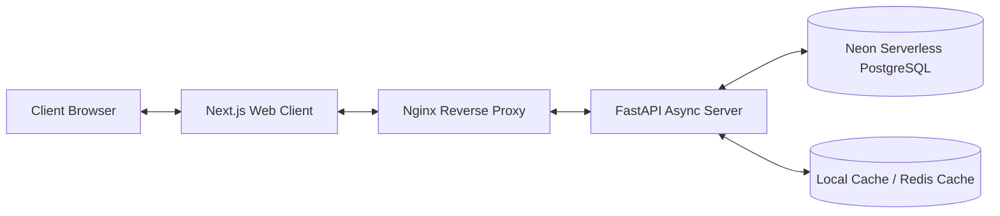

# CarbonTracker AI — Architecture Documentation

**Status:** Certified Architecture Mapping

---

## 1. System Block Diagram

CarbonTracker AI splits logic into three micro-container components linked via API routing.

---

## 2. Component Specifications

### 2.1 Web Frontend
-   **Static Site Generation (SSG)**: Statically generates pages (like `/login`, `/register`) to guarantee fast initial paints.
-   **Zustand/Store state management**: Context structures hold active authentication keys, summary metrics, and calculations history.
-   **Lazy Loading**: Suspends sub-views (like analytics Recharts widgets) during initial rendering to speed up interaction thresholds.

### 2.2 FastAPI Server
-   **Asynchronous ASGI loop**: Handles non-blocking requests to Neon DB pools.
-   **Middleware wrapping**: Custom interceptors handle request timing audits, CORS OPTIONS bypass routines, and request ID correlations.
-   **NLP calculations mapper**: Coordinates parsing requests with standard emission databases.
