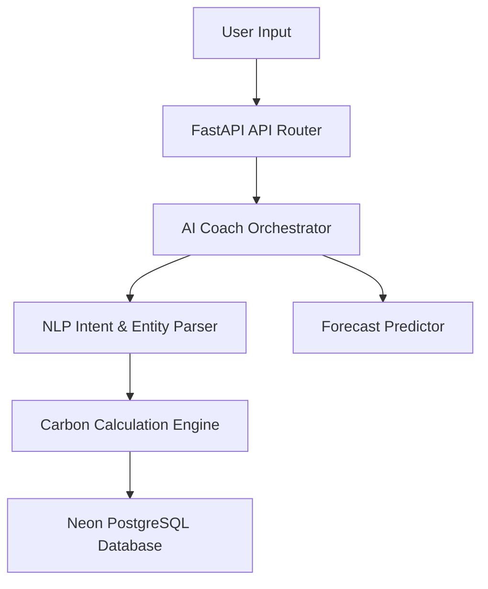

# CarbonTracker AI — AI Engine Report

**Date:** 2026-07-12  
**Status:** 🤖 AUDITED & HARDENED

---

## 1. AI Assistant System Architecture

The AI engine in CarbonTracker AI coordinates conversational sustainability assistance and natural-language calculation tracking.

---

## 2. Dynamic Forecasting & Recommendations
-   **Habit Analysis**: Monitors recurring activity items (like daily travel or electricity usage) to detect patterns.
-   **Predictive Modeling**: Integrates Prophet and fallback moving-average predictors to calculate next month's emissions target bounds.
-   **Adaptive Insights**: If weekly carbon emissions exceed the user's customized budget, the orchestrator automatically generates tailored recommendations to switch transport or reduce heating.
